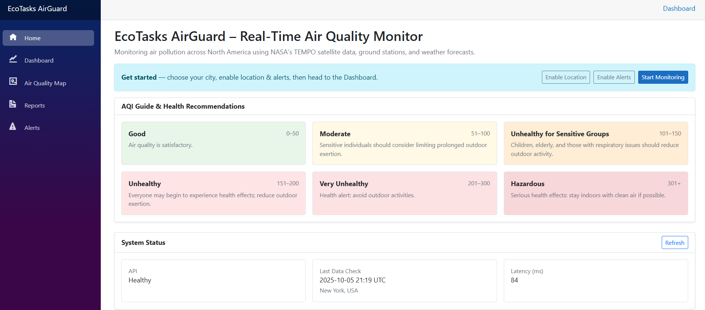
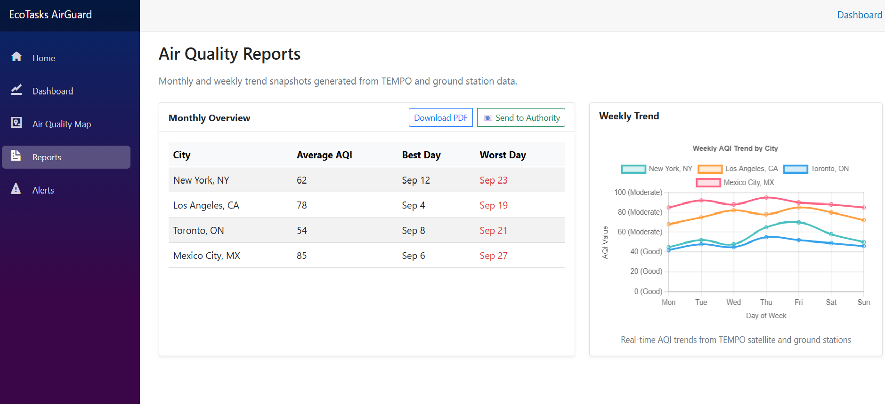
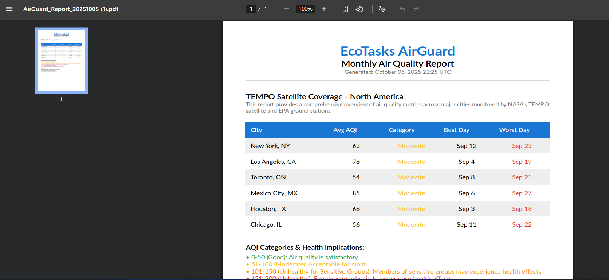
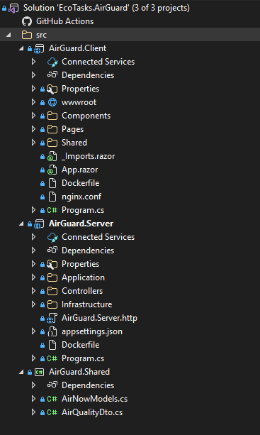

docker compose up --build
## EcoTasks AirGuard 🌍🚀

Comprehensive Blazor WebAssembly + ASP.NET Core 8 application delivering near real‑time North American air quality (AirNow) combined with contextual weather (OpenWeather) and TEMPO coverage concepts. Includes forecasting, alerts, PDF reporting, onboarding UX, and security-focused containerization.

Dev baseline: HTTP (API 5100 / Client 5188)  |  Hardened production profile: HTTPS + HSTS + non‑root containers.

---

## 🎬 Live Demo Video

[](https://drive.google.com/file/d/1em7W0qHB2eDxB92Ytm68QgTHVlAqN-0I/view?usp=sharing)

Watch our comprehensive demonstration showcasing:
- 🏠 **Home Page** - Onboarding with AQI guide and system status
- 📊 **Dashboard** - Live air quality data and 12-hour forecasts  
- 🗺 **Interactive Map** - TEMPO coverage with city indicators
- 🚨 **Smart Alerts** - Real-time filtering of unhealthy air conditions
- 📄 **Reports** - Monthly trend analysis and PDF generation
- 🐳 **Docker Deployment** - One-command containerized setup

---

## 🔥 60‑Second Quick Start

```powershell
cd docker
docker compose up --build
```

Then open:
- Client UI: http://localhost:5188
- API:       http://localhost:5100
- Swagger:   http://localhost:5100/swagger
- Health:    http://localhost:5100/health

Stop:
```powershell
docker compose down
```

---

## ✨ Key Features

- Live AQI + pollutant metrics (PM2.5, NO₂, O₃) with category coloring
- 12‑hour PM2.5 forecast chart (Chart.js via simple JS interop)
- City selection (config-driven) + bulk recent snapshot loading
- Alerts page with filtering (All / Unhealthy / Very Unhealthy) & gradient styling
- Onboarding / Home page: AQI guide, system status latency probe, “What’s New” & credits
- PDF report generation scaffold (QuestPDF integration point)
- Resilient data loading: timeout + exponential retry logic (dashboard)
- Health checks (liveness + custom API key presence)
- Clean project segmentation (`Client`, `Server`, `Shared`) using shared DTOs

---

## 🛡 Security & Hardening (Implemented)

| Area | Status | Notes |
|------|--------|-------|
| Secrets handling | ✅ | API keys removed from source; loaded via environment variables (`OpenWeather__ApiKey`, `AirNow__ApiKey`). |
| API key health check | ✅ | Custom health check surfaces Missing / Partial / OK states. |
| Non‑root containers | ✅ | Server image creates `appuser` (no password) and drops root privileges. |
| HSTS / HTTPS behavior | ✅ | Enforced only in non‑Development to avoid local friction. |
| CORS & base URL hygiene | ✅ | Explicit base URL + trailing slash prevents client fetch issues. |
| Error surface minimization | ✅ | Fail‑fast on missing keys with clear internal log. |
| Environment segregation | ✅ | `ASPNETCORE_ENVIRONMENT` used for conditional middleware (Swagger redirects, HSTS). |

Planned / Suggested Enhancements:
- Add rate limiting middleware (`AspNetCore.RateLimiting`).
- Implement structured logging & distributed tracing (OpenTelemetry + OTLP exporter).
- Content Security Policy (CSP) header & security headers bundle.
- Automatic key rotation / secret manager integration (Azure Key Vault or AWS Secrets Manager).
- Role-based auth (JWT) + scoped endpoints.

---

## ⚙️ Configuration

| Variable | Purpose | Example |
|----------|---------|---------|
| OpenWeather__ApiKey | Weather context enrichment | (set in .env / deployment secret) |
| AirNow__ApiKey | Air quality measurements | (set in .env / deployment secret) |
| ASPNETCORE_ENVIRONMENT | Environment discriminator | Development / Staging / Production |
| API_BASE_URL (client) | Client→API base (with trailing slash) | http://localhost:5100/ |

Client also loads `/appsettings.json` (served from `wwwroot`) for `ApiBaseUrl` fallback.

---

## 🧪 Health & Observability

- `/health` returns composite status (includes API key presence).
- Root (`/`) in Development redirects to `/swagger` for fast API discovery.
- Latency probe on Home page pings `health` + a data endpoint to show round‑trip timing.

---

## � Application Screenshots

Below are selected screenshots demonstrating key features of the EcoTasks AirGuard system:

| Feature | Screenshot | Description |
|----------|-------------|-------------|
| 🏠 **Home Page** |  | Onboarding interface with AQI guide and system status overview |
| 📊 **Dashboard** |  | Live air quality data with 12-hour PM2.5 forecast chart |
| 🗺 **Air Quality Map** |  | TEMPO coverage visualization with city-level AQI indicators |
| 📄 **Reports** |  | Monthly/weekly trend analysis with comprehensive summaries |
| 📤 **Send Report Modal** |  | Government reporting workflow with authority selection |
| 🚨 **Alerts** |  | Real-time alerts for cities exceeding healthy air thresholds |
| 🧾 **PDF Export** |  | Generated PDF report sample (QuestPDF integration) |
| ⚙️ **Swagger API** |  | Interactive API documentation and testing interface |
| 🐳 **Docker Running** |  | Container orchestration showing healthy API and Client services |
| 🧱 **Architecture** |  | Visual Studio project structure (Client/Server/Shared separation) |

---

## �🚀 Running Locally (Without Docker)

API:
```powershell
cd src\AirGuard.Server
set OpenWeather__ApiKey=YOUR_KEY
set AirNow__ApiKey=YOUR_KEY
dotnet run --urls http://localhost:5100
```

Client:
```powershell
cd src\AirGuard.Client
dotnet run
```

Hot Reload (either project):
```powershell
dotnet watch run
```

---

## 🐳 Docker Workflow

Build & run full stack:
```powershell
cd docker
docker compose up --build
```

Rebuild API only (if you changed server code):
```powershell
docker compose up -d --build airguard-api
```

Pass API keys (example .env snippet):
```
OpenWeather__ApiKey=REPLACE_ME
AirNow__ApiKey=REPLACE_ME
```

Shutdown:
```powershell
docker compose down
```

---

## 📁 Project Structure (Condensed)

```
src/
  AirGuard.Client/   # Blazor WASM UI (charts, onboarding, alerts)
  AirGuard.Server/   # ASP.NET Core API (AirNow/OpenWeather integration, health)
  AirGuard.Shared/   # DTOs shared between client & server
docker/               # Compose + helper scripts
```

---

## 🧩 Technology Stack

| Layer | Tech |
|-------|------|
| UI / SPA | Blazor WebAssembly (.NET 8) |
| API | ASP.NET Core 8 minimal & controllers |
| Charts | Chart.js (interop) |
| Reporting | QuestPDF (planned monthly report pipeline) |
| External Data | AirNow (AQI), OpenWeather (weather context) |
| Container Base | mcr.microsoft.com/dotnet/sdk & aspnet:8.0 (non‑root hardened) |

---

## 🧱 Resilience Patterns

- City data fetch: timeout (8s) + exponential retry (3 attempts) with cancellation tokens.
- Graceful fallback for city list (embedded defaults if JSON config fails).
- Client-side error banners for partial failures.

---

## 🗺 Roadmap (Next)
- Dynamic Alerts API endpoint (currently static set → move server-driven)
- Historical persistence (PostgreSQL + retention policy)
- OpenTelemetry traces + metrics + logs
- JWT auth + role gating for admin/report actions
- Multi-language UI (i18n service abstraction)
- Advanced caching (Memory + optional Redis layer)
- Rate limiting & abuse prevention
- CSP / security headers middleware bundle

---

## 🔐 API Keys (Placeholders Only)
Never commit real keys. Use environment variables, user‑secrets, or orchestrator secret stores.

Example (PowerShell session):
```powershell
$env:OpenWeather__ApiKey="..."; $env:AirNow__ApiKey="..."; dotnet run
```

---

## 📜 License & Attribution
NASA Space Apps Challenge 2025 submission.

---

Built with ❤️ for cleaner air.

Team: EcoTasks  |  Stack: .NET 8, Blazor, Chart.js, QuestPDF, AirNow, OpenWeather
